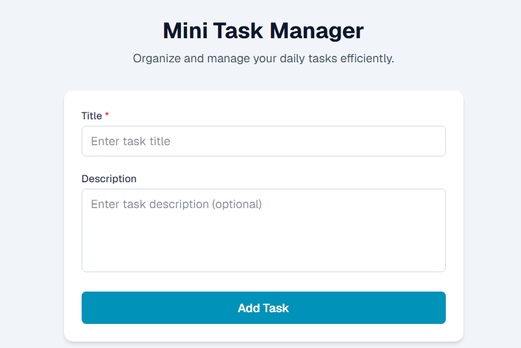
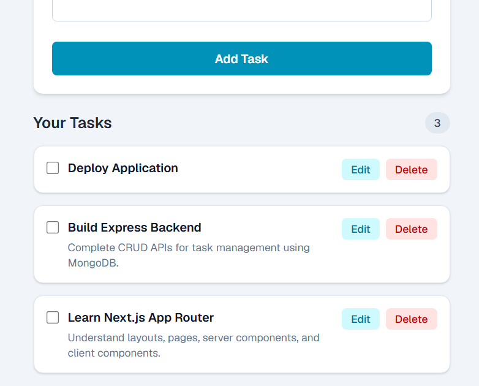

# Mini Task Manager

[](https://mini-task-manager-eight.vercel.app/)

A full-stack Task Manager application built with **Next.js**, **TypeScript**, **Node.js**, **Express**, and **MongoDB**. The application allows users to create, view, update, complete, and delete tasks through a clean and responsive interface.

---

## 📷 Screenshots

### Task Form



### Tasks



---

## Features

- Create a new task
- View all tasks
- Update task title and description
- Mark tasks as completed
- Delete tasks
- Input validation
- Error handling
- Responsive UI
- Clean and modular project structure

---

## Tech Stack

### Frontend

- Next.js (App Router)
- React
- TypeScript
- Tailwind CSS
- Axios

### Backend

- Node.js
- Express.js
- TypeScript
- MongoDB
- Mongoose
- Express Validator

---

## Project Structure

```text
client/
├── src/
│   ├── app/
│   │   ├── globals.css
│   │   ├── layout.tsx
│   │   └── page.tsx
│   ├── components/
│   │   ├── TaskCard.tsx
│   │   ├── TaskForm.tsx
│   │   └── TaskList.tsx
│   ├── services/
│   │   ├── api.ts
│   │   └── taskService.ts
│   ├── types/
│   │   └── task.ts
│   └── utils/
│       └── getErrorMessage.ts
│
└── .env.local


server/
├── src/
│   ├── config/
│   │   └── db.ts
│   ├── controllers/
│   │   └── taskController.ts
│   ├── middleware/
│   │   └── validationMiddleware.ts
│   ├── models/
│   │   └── Task.ts
│   ├── routes/
│   │   └── taskRoutes.ts
│   ├── validations/
│   │   └── taskValidation.ts
│   └── server.ts
│
└── .env
```

---

## Installation

### Clone the repository

```bash
git clone https://github.com/premasagarbontula/mini-task-manager
cd Mini-Task-Manager
```

---

### Backend Setup

```bash
cd server
npm install
```

Create a `.env` file:

```env
PORT=5000
MONGO_URI=your_mongodb_connection_string
```

Start the backend:

```bash
npm run dev
```

---

### Frontend Setup

```bash
cd client
npm install
```

Create a `.env.local` file:

```env
NEXT_PUBLIC_API_URL=http://localhost:5000/api/tasks
```

Start the frontend:

```bash
npm run dev
```

---

## API Endpoints

| Method | Endpoint         | Description   |
| ------ | ---------------- | ------------- |
| GET    | `/api/tasks`     | Get all tasks |
| POST   | `/api/tasks`     | Create a task |
| PATCH  | `/api/tasks/:id` | Update a task |
| DELETE | `/api/tasks/:id` | Delete a task |

---

## Validation

- Task title is required.
- Title cannot be empty.
- MongoDB ObjectId is validated before update and delete operations.
- Server-side validation is implemented using Express Validator.

---

## Design Decisions

- Used **Next.js App Router** for the frontend.
- Used **TypeScript** across both frontend and backend for type safety.
- Separated API logic into a dedicated service layer.
- Reused a common error handling utility on the frontend.
- Implemented a modular backend structure with controllers, routes, validations, middleware, and models.
- Used `router.refresh()` after CRUD operations to keep the UI synchronized with the server.

---

## Future Improvements

- Search and filter tasks
- Task categories and priorities
- Due dates
- Authentication and user-specific tasks
- Pagination
- Toast notifications instead of browser alerts
- Optimistic UI updates

---

## Author

**Prema Sagar Bontula**
